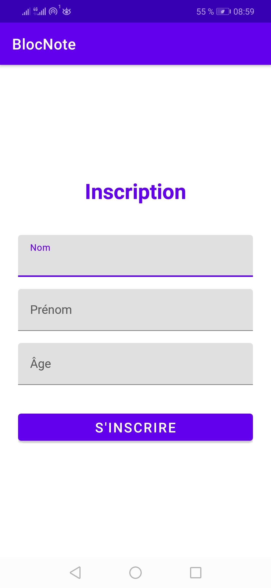
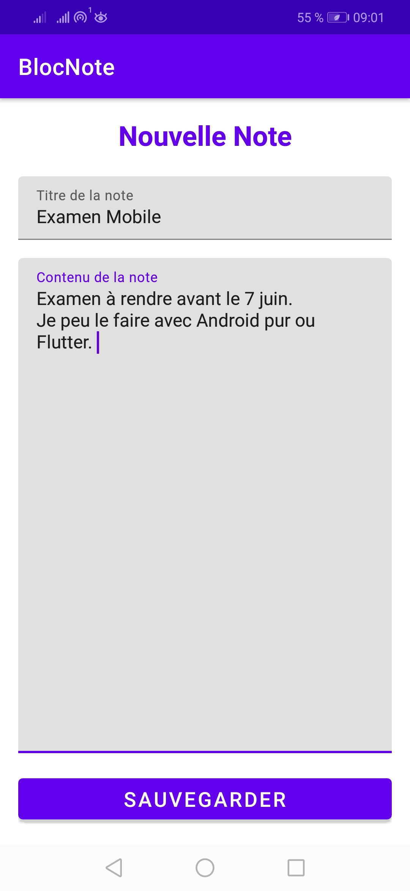
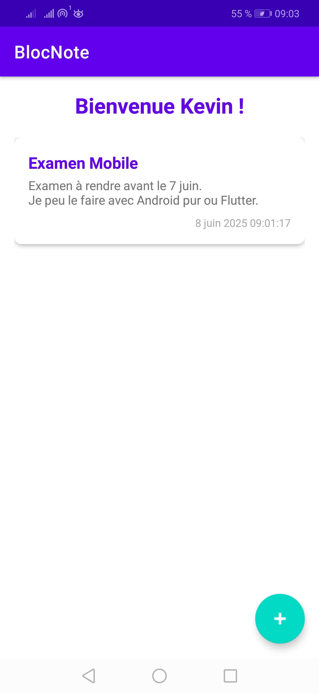
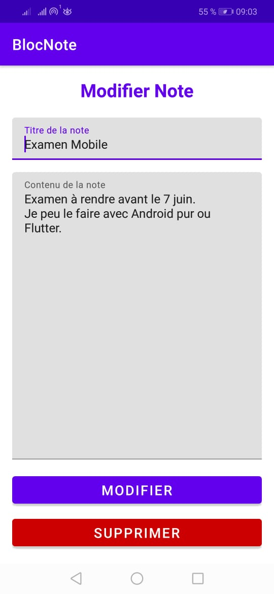

# FALISOA Kevin 61/LA/24-25
# ANDRIANJATOVO Lanja Mirantsoa 50/LA/24-25

# KevinfalsBlocnote

Application de prise de notes simple et intuitive.

## Fonctionnalités principales

- 📝 **Gestion des notes** :
  - Création, consultation, modification et suppression de notes
  - Affichage chronologique des notes
  - Sauvegarde automatique dans une base de données locale

- 👤 **Système d'inscription** :
  - Premier lancement avec formulaire d'inscription obligatoire
  - Persistance des informations utilisateur

## Captures d'écran

| Écran d'inscription | Création de note | Liste des notes  | Modification de note  |
|---------------------|----------------- |------------------|
|  |  |  |  |